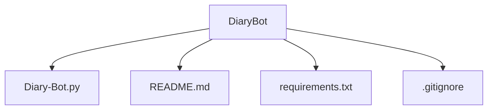

# Diary Bot: NLP Application

## Table of Contents
1. [Overview](#overview)
2. [Features](#features)
3. [Limitations](#limitations)
4. [Installation](#installation)
5. [Usage](#usage)
6. [Repository Structure](#repository-structure)
7. [Conclusion](#conclusion-and-future-work)

## Overview

The Diary Bot is a local Python-based chatbot designed to help users reflect on their day by recording diary-like entries. Leveraging the spaCy NLP library, the bot is capable of:

- Understanding different types of sentences, including WH-questions, Yes/No questions, wishes, instructions, and generic statements.
- Rearranging sentence structures to provide qualitative, conversational responses.
- Applying simple point-of-view transformations to personalize replies.
- Annotating each response with the current day and time for diary tracking purposes.

This application serves as a basic, interactive NLP tool that demonstrates core concepts such as tokenization, dependency parsing, and rule-based matching, all within a local console environment.

## Features

The Diary Bot offers the following features:

- **Personalized Interaction**: Greets the user by name and incorporates it into responses.
- **Sentence Type Detection**: Distinguishes between WH-questions, Yes/No questions, wishes, instructions, and generic statements.
- **Verb Phrase Analysis**: Identifies and processes verb phrases to construct coherent responses.
- **Point-of-View Conversion**: Adjusts sentences from first-person to second-person perspective and vice versa to maintain conversational flow.
- **Diary Annotation**: Automatically includes the current day and time with each response, helping users track their diary entries.
- **Local Console Interface**: Operates entirely in a local Python console, requiring no external messaging platform or API.
- **Randomized Replies**: Provides variability in responses to keep interactions engaging.

## Installation

Follow these steps to set up the Diary Bot locally:

1. **Clone the Repository**  
   Clone this repository to your local machine:
   ```bash
   git clone <YOUR_REPOSITORY_URL>
   cd <REPOSITORY_FOLDER>
   ```
   
2. **Set Up Virtual Environment** <br>
    Create a virtual environment to manage dependencies:
    <br>
    ```bash
   python -m venv venv
   ```
3. **Install Dependencies** <br>
Install the required packages listed in requirements.txt:
 ```bash
  pip install -r requirements.txt
   ```

4. **Download spaCy Model** <br>
Ensure the en_core_web_sm model is installed:
```bash
  python -m spacy download en_core_web_sm
   ```

5. **Run the Diary Bot** <br>
Launch the bot:
```bash
  python Diary-Bot.py
   ```

## Usage

1. **Starting the Bot**  
   Run the bot using the command `python Diary-Bot.py`. You will be prompted to enter your name, which allows the bot to personalize responses.

2. **Interacting with the Bot**  
   - Type your diary entries or questions in the console.
   - The bot will process each sentence, detect its type (WH-question, Yes/No question, wish, instruction, or generic), and generate an appropriate response.
   - Each response will include the current day of the week and time.

3. **Ending the Session**  
   To exit the bot, type `exit` or `quit`. The bot will display a farewell message including your name.

4. **Example Interaction**
```commandline
Welcome! What's your name? Tino
Hello Tino! Let's reflect on your day. Type 'exit' to quit.
Tino: I want to write about my day.
Bot: [Monday, 14:35] Tino, Got it: I want to write about my day.

Tino: How was the weather today?
Bot: [Monday, 14:36] Tino, I can't say how the weather today was, but keep reflecting on it.

Tino: exit
Goodbye Tino! Have a great day!
```

## Limitations

1. **Scope of NLP Understanding**  
   - The bot uses rule-based sentence classification with spaCy and does not employ advanced machine learning or context-aware conversation.  
   - It may misclassify sentences or fail to understand nuanced inputs, idiomatic expressions, or highly complex sentences.

2. **Diary Context**  
   - The bot does not retain memory between sessions; each session is independent.  
   - It cannot store or retrieve past diary entries, limiting its use as a long-term diary companion.

3. **Responses**  
   - Responses are generated with simple templates and random selection; they may occasionally feel generic or repetitive.  
   - The bot cannot answer factual questions accurately, it can only give placeholder responses.

4. **User Input Requirements**  
   - The bot requires reasonably well-formed sentences. Extremely short, incomplete, or ambiguous inputs may result in incorrect handling.  
   - Non-English input is not supported and may produce errors.

5. **Console-Based Interaction**  
   - The current implementation runs locally in the console; there is no graphical interface or Telegram integration.  
   - Input and output are limited to text; no multimedia, formatting, or external data sources are supported.


## Repository and Verification

### Repository Structure




2. **Verifying the Solution**

- Clone the repository to your local machine: `git clone <repository-url>`
- Navigate to the project folder: `cd DiaryBot`
- Set up a virtual environment and install dependencies (see Installation section)
- Run the bot: `python Diary-Bot.py`
- Interact with the bot by typing diary entries, questions, or reflections
- Type `exit` or `quit` to close the session
- Confirm that:
  - The bot addresses you by the name you provide
  - Current day and time are displayed with each response
  - Sentence types are handled correctly (WH-questions, yes/no, wishes, instructions, generic)
  - Point-of-view conversion is applied in responses

## Conclusion and Future Work

### Conclusion
This Diary Bot provides a simple, local NLP-based interface for personal reflections. It demonstrates:

- Use of spaCy for natural language processing
- Sentence type recognition (WH-questions, yes/no questions, wishes, instructions, generic)
- Verb phrase identification
- Point-of-view conversions for more natural responses
- Dynamic inclusion of user name, current day, and time in replies

While the bot is basic, it successfully simulates a conversational diary entry assistant for local use.

### Limitations
- Only works locally; does not integrate with Telegram or other messaging platforms
- Responses are generated using simple template-based logic and randomization, so may sometimes feel repetitive or generic
- Complex sentences or unusual grammar may not be interpreted accurately
- Cannot store or recall previous diary entries

### Future Work
- Add persistent storage for diary entries
- Introduce sentiment analysis to provide mood tracking
- Expand sentence type handling with more sophisticated NLP models
- Integrate with Telegram or web interfaces for broader access
- Implement more context-aware and personalized responses

   

